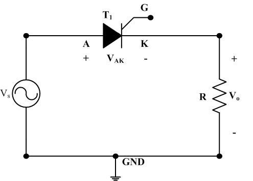
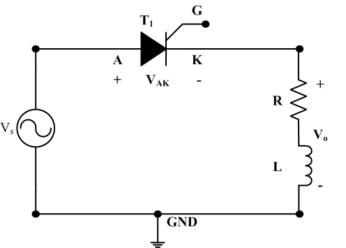
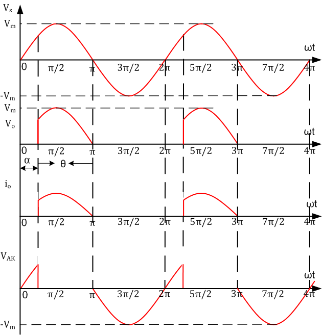

The circuit diagram of single phase half wave controlled rectifier with resistive R load and RL load is shown in Fig. 1(a) and Fig. 1(b) respectively. This is the simplest form of controlled rectifier which consists of a single thyristor feeding DC power to a resistive load or inductive load.

<table>
  <tr>
    <td></td>
  <td></td>
  </tr>
  <tr>
    <td>
(a)
</td>
  <td>
(b)
</td>
  </tr>
  </table>
  
Fig. 1. Half wave controlled rectifier circuit with (a) R-Load (b) RL-Load

For the supply voltage of  , the SCR can conduct only when anode voltage is positive and a gate signal is applied. Therefore, the rectification process of half wave controlled rectifier with R-load can be explained as:

1.	During the positive half-cycle of the supply voltage, the SCR is forward-biased and will conduct if a trigger is applied to the gate. Let, SCR is triggered at some firing angle α, the load current flows and the output voltage Vo will be the same as the input voltage. 

2.	At time t = π, the current falls natural to zero, since the SCR is reverse-biased. Therefore, during the negative half-cycle, the SCR blocks the flow of current, and no voltage is applied to the load. 

3.	The SCR stays off until the gate signal is applied again at (α + 2π). 

The period from 0 to α in Fig. 2 represents the time in the positive half-cycle when the SCR is off. This angle (measured in degrees) is called the firing angle (α). The SCR conducts from α to π; this angle is called the conduction angle (θ).

Unlike R Load, thyristor does not go into blocking state at ωt = π as inductance forces to load current rise gradually. After ωt = π, output current output current approaches to zero at some angle β called extinction angle and (β – α) = γ is called conduction angle. Different waveforms for RL load is shown in Fig. 3.

 
 

   
Fig. 2. Half wave controlled rectifier output plots

   
<h5>•	For R-Load</h5>
<b>The average or DC value of the load voltage is given by: </b> 

<pre>Vo,avg =(Vm/2&#120587;)(1+cos &prop;)                                                               (1)</pre>
 
<b>The RMS value of the load voltage is given by: </b> 

<pre>Vor =(Vm/2&radic;&#120587;)[(&#120587;-&prop;)+(1/2)(sin 2&prop;)]1/2                                              (2)</pre>
 
<b>The average or DC value of the load current is given by</b> 

<pre>Vo,avg =(Vm/2&#120587;R)(1+cos &prop;)                                                              (3)</pre>
 

Increasing α by firing the SCR later in the cycle lowers the voltage, and vice versa. The maximum average output voltage occurs when α = 0° and given by
 
<pre>Vo,avg =(Vm/2&#120587;)(1+cos 0)= Vm/2&#120587;                                                         (4)</pre>
 
This is the same voltage as for a half-wave diode rectifier. Therefore, if the SCR is fired at α = 0°, the circuit acts like a diode rectifier. 
<h5>•	For RL-Load</h5>
<b>The average or DC value of the load voltage is given by: </b> 

<pre>Vo,avg =(Vm/2&#120587;)(cos &#946;-cos &prop;)                                                            (5)</pre>
 
<b>The RMS value of the load voltage is given by: </b> 

<pre>Vor =(Vm/2&radic;&#120587;)[(&#946;-&prop;)+1/2(sin 2&#946;-sin 2&prop;)]1/2                                      (6)</pre>
 
The average or DC value of the load current is given by 

<pre>Vo,avg =(Vm/2&#120587;R)(cos &#946;-cos &prop;)                                                            (7)</pre>
 
                                                                                    
                                                                                    
                                                                                    

