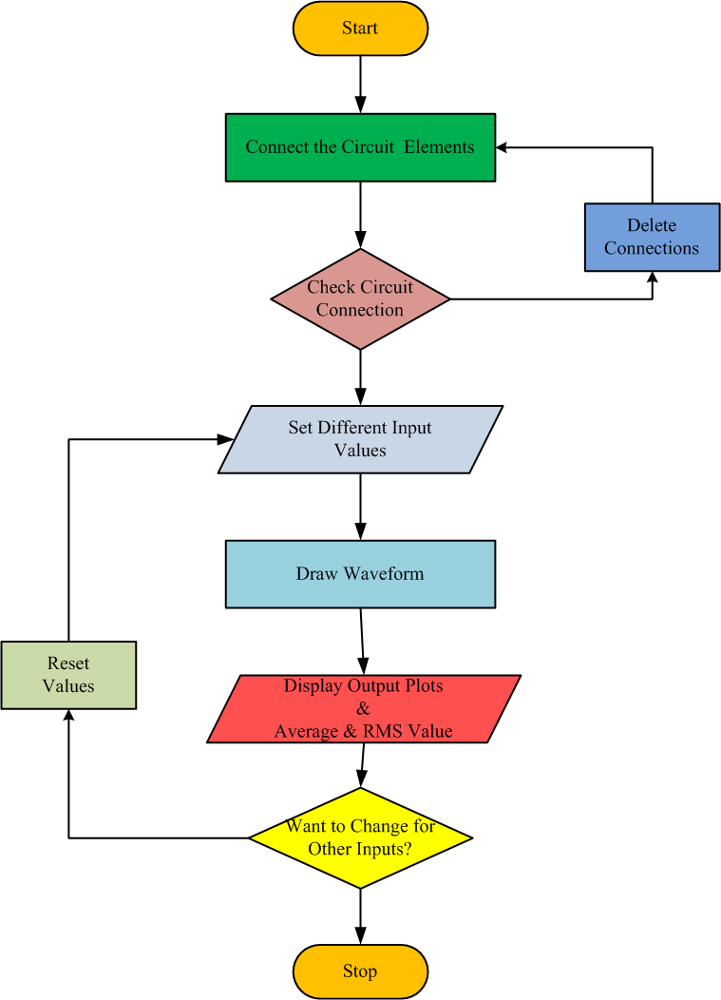
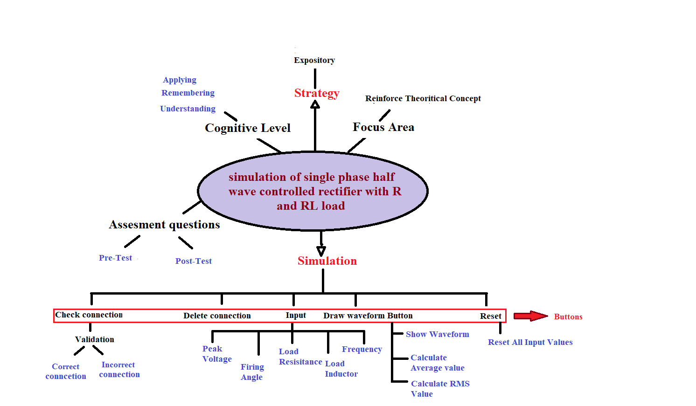

## Storyboard (Round 2)

Experiment 1:To obtain the simulation of single phase half wave controlled rectifier with R and RL load and plot load voltage and load current waveforms.

### 1. Story Outline:

The uses approaches to the simulator to understand the basic concept of firing angle and its use in half wave controlled rectifier. The simulator has six scroll buttons which are used by the user to control the different parameters. User scrolls the firing angle button to change the value of firing instant of the thyristor to control the DC value of output voltage. The resistance scroll button is used by the user to set the load resistance value of the circuit.

There are three generalized button for the whole button. User may use the Vmax and Tmax scrolls button to zoom in or zoom out all the plots for clear visualization. User may use the average voltage and RMS voltage buttons for the calculation of corresponding values of output voltages.

### 2. Story:

The story is started with a character called thyristor. In our daily life we learn many thing with their pros and cons. Similarly, in this experiment we learn to control the output DC voltage by delaying the ON position of the thyristor. Here thyristor acts just like a switch which is used to obtain the average output voltage according to our needs. User initiates the process to delay the switch ON position by setting the value of firing angle. The whole story design process of simulation experiment is narrated as a story which consists of the description of the visual stage, the goals and objectives planned and the pathway set for the learner. Moreover a few challenges and pitfalls are also set to underline and emphasize the concepts involved in the experimentation. Every stage is described thoroughly in the following subsections.

#### 2.1 Set the Visual Stage Description:

The simulator starts with the experiment name on the top and asking for the input whether user need to do experiment for R load or RL load. The simulator consists of five blocks: four blocks with inputs and outputs and one block with drop down instruction lists. User needs to connect the circuit as given in instructions. After proper connections, user needs to enter the desired value of input supply, load resistance, load inductance, frequency and firing angle given in left side block. Now, user may hit the “Draw Waveform” button to obtain the output waveforms in right block and average and RMS output voltage in left block. If user thinks that he enters some wrong value by mistake, there is a RESET button next to Draw Waveform button to reset the inputs. 

#### 2.2 Set User Objectives & Goals:

The main objective of this experiment is  to let the user know about the functioning of thyristor and its appliaction as half wave controlled rectifier. At the end of the module the student would be able to understand: 
1.	The difference between half wave uncontrolled rectifier and half wave controlled rectifier. 
2.	The role of firing angle to control the DC and RMS values output voltage. 
3.	The effect of load inductance on the conduction of thyristor. 
4.	The effect of load inductance on different types of output waveforms. 

#### 2.3 Set the Pathway Activities:

1.	click on the simulator tab. 
2. click on either R-Load or RL-Load button. 
3. Set the connection in circuit.  
4. Check Connections.  
5. Set the peak value of input supply Vp. 
6.	Set the value of firing Angle α. 
7.	Set the value of load resistance RL and Load inductance L. 
8.	Set the Frequency of input Supply fo. 
9.	Set the Vmax  range. 
10.	Set the Tmax range. 
11.	Change the value of total point for the plot. 
12.	Click on "Draw Waveform" button. 
13.	Click on "Average Voltage" button. 
14.	Click on "RMS Voltage". 

##### 2.4 Set Challenges and Questions/Complexity/Variations in Questions:
<h5> Task 1: Understanding half wave controlled rectifier experiment</h5>
<h5>Assessment Questions:</h5>
1. Once you move on the simulator page what is the default value of peak voltage? 
2. What difference do you observe between current waveforms of R and RL loads? 
3. What result do you expect when you change the value of load inductance? 
4. What result do you expect when you change the value of load resistance? 
5. Interpret and conclude the experiment. 

<h5> Task 2: Simulate the half wave controlled rectifier with the simulator. [LO1, LO2, LO3, LO4, LO5]</h5>
<b>Difficuty level: Remember 
1. The SCR ratings, di/dt in A/µsec and dv/dt in V/µsec, may vary, respectively, between</b> 
(a)	20 to 500, 10 to 100. 
<b>(b)	Both 20 to 500.</b> 
(c)	Both 10 to 100. 
(d)	50 to 300, 20 to 500. 

<b>Difficuty level: Understand 
2. A single phase half-wave controlled rectifier is used to feed the DC power to resistive load. If this circuit is fired at an angle α, what will be the shape of output current: </b>
a.	 A full wave similar to input supply. 
b.	A half wave opposite to output voltage. 
<b>c.	A half wave similar to output voltage.</b> 
d.	A half wave with α phase lag to output voltage. 

<b>Difficuty level: Understand 
3. In a thyristor, the ratio of holding current to latching current is </b>
<b>(a)	0.4</b> 
(b)	1.0 
(c)	2.5 
(d)	4.0 

<b>Difficuty level: Apply

4. A single phase half-wave controlled rectifier has 400*sin(314t) as the input voltage and R as the load. For a firing angle of 60o for the SCR, the average output voltage is</b> 
(a)	400/π 
<b>(b)	300/π</b> 
(c)	200/π 
(d)	240/π 

<b>Difficuty level: Apply

5.  voltage source 200sin*(314t) is applied to a thyristor controlled half-wave rectifier with a resistive load of 50 Ω. If the firing angle is 30o with respect to supply voltage waveform, the average power in the load is</b> 
(a)	90.6 watts 
(b)	86.3 watts 
(c)	60.8 watts 
 <b>(d)	70.6 watts</b> 

##### 2.5 Allow pitfalls:
1.	User will get an error message if the circuit connection is wrong. 
2.	User will get wrong waveform if the number of points to be appear on plot are very less. 
3.	Once user hits Draw Waveform button, the values would be locked. 

##### 2.6 Conclusion:
1. The pre-test and post-test assessment must be provided immediately to the user.  
2. The correct answer must be displayed to the user after clicking the submission button. 
3. This would help the user to gain the basic knowledge of the experiment. 
4. The performance feedback of user should be calculate on the basis of marks assigned to each question  

##### 2.7 Equations/formulas:
<b> 1.  For R Load</b> 
<b>The average or DC value of the load voltage is given by: </b> Vo,avg = Vm/2&#120587;(1+cos &prop;)                                      (1) 
<b>The RMS value of the load voltage is given by: </b> Vor = Vm/2&radic;(&#120587;)   [(&#120587;-&prop;)+1/2(sin 2&prop;)]                (2)  
<b> 2.  For RL Load</b> 
<b>The average or DC value of the load voltage is given by: </b> Vo,avg = Vm/2&#120587;(cos &#946;-cos &prop;)                                  (1) 
<b>The RMS value of the load voltage is given by: </b> Vor = Vm/2&radic;(&#120587;)   [(&#946;-&prop;)+1/2(sin 2&#946;-sin 2&prop;)1/2]                (2) 

### 3. Flowchart 4
 

### 4. Mindmap:

### 5. Storyboard :
Storyboard: <a href="Storyboard/carwiper.gif"> [here]</a>
Link to storybaord (.gif file ) here :
(guide: This document should include sketching and description scene wise (duration, action, description). Software to be used for storyboarding : https://wonderunit.com/storyboarder/ (Its a FOSS tool) . tutorial on how to use it https://www.youtube.com/watch?v=LAeCEpG0KX4
